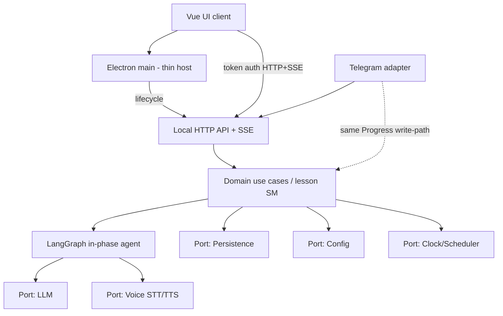
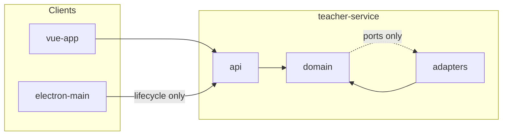
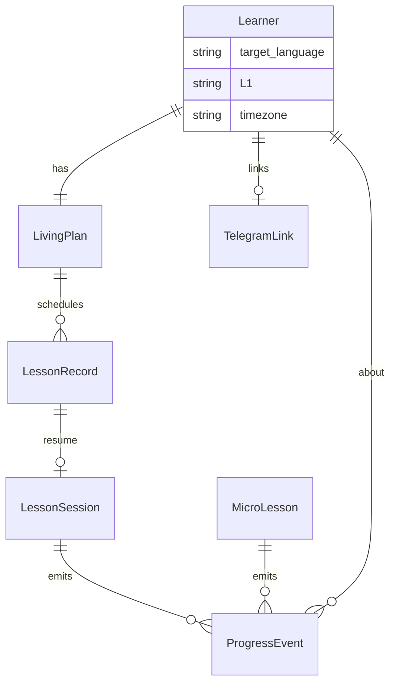

# Architecture Spine — ai-language-teacher

## Design Paradigm

**Hexagonal (ports & adapters)** on the Python teacher service.

| Hexagon role            | Maps to                                                                                               |
| ----------------------- | ----------------------------------------------------------------------------------------------------- |
| Domain (center)         | Pedagogy: Living plan, lesson templates/phases, session, Progress/errors, placement, scheduling rules |
| Driving adapters        | Vue UI (via local HTTP API), Telegram bot, scheduler/clock ticks                                      |
| Driven ports + adapters | LLM, Voice (STT/TTS), Persistence (SQLite), Config/secrets, Telegram delivery                         |

Electron main is **not** a domain layer — thin host only (window + service lifecycle).



## Invariants & Rules

### AD-1 — Hexagonal teacher core `[ADOPTED]`

- **Binds:** Python teacher service; all pedagogy and scheduling logic
- **Prevents:** UI / Electron / Telegram / vendor SDKs embedding lesson or plan rules
- **Rule:** Domain depends only on ports. Adapters implement LLM, Voice, Telegram, Persistence, Config, Clock. Domain must not import Vue, Electron, Telegram SDK, or vendor voice/LLM SDKs.

### AD-2 — Process topology: service + thin Electron `[ADOPTED]`

- **Binds:** runtime deployment of v1 desktop
- **Prevents:** teaching/scheduling dying with the UI window; business logic in Electron main
- **Rule:** Python teacher runs as a background user service (tray/user-service). Electron main starts/monitors/stops the service and hosts the Vue window only. Closing the window must not stop reminder/micro-lesson delivery.

### AD-3 — Single local HTTP API facade `[ADOPTED]`

- **Binds:** UI↔teacher and any local client↔teacher contract
- **Prevents:** dual HTTP vs IPC domain contracts; Electron IPC as domain bus
- **Rule:** Domain commands/queries use **loopback HTTP only** on the teacher service. Electron IPC is limited to window/lifecycle (start/stop/status). Telegram is an adapter to the **same** domain, not a second domain model.

### AD-4 — Local API trust boundary `[ADOPTED]`

- **Binds:** local API, secrets, NFR-1
- **Prevents:** LAN exposure; unauthenticated local callers; keys/PII identity in LLM prompts
- **Rule:** API binds loopback-only. Every local client uses a mandatory local auth token on HTTP and SSE. Learner-configured secrets (LLM, Telegram, optional cloud voice) live behind the Config port on disk with OS permissions and must not be injected into LLM prompts as free-text identity.

### AD-5 — Live lesson SSE stream `[ADOPTED]`

- **Binds:** in-lesson UI sync; NFR-3 continuity signaling
- **Prevents:** polling-only clients; SSE vs WebSocket split; silent hangs
- **Rule:** During a lesson, the service pushes **SSE** events for phase changes, audio-ready, teacher turns, and error/retry. Commands remain HTTP request/response. Stream and REST share the same wire conventions (AD-16).

### AD-6 — State ownership `[ADOPTED]`

- **Binds:** Living plan, Progress/errors, lesson session
- **Prevents:** dual writers; UI/Telegram rewriting curriculum; split stat stores; ephemeral-only sessions
- **Rule:**
  - Living plan mutations: teacher-only via domain use cases (LLM-orchestrated where needed). UI/Telegram issue commands; they do not write plan rows directly.
  - Progress/errors: one write-path for lesson and micro-lesson completion.
  - In-progress `LessonSession` persists for resume; UI must not hold a competing source of truth.

### AD-7 — SQLite as sole durable store `[ADOPTED]`

- **Binds:** plan, session, Progress/errors, prefs, Telegram link metadata
- **Prevents:** split JSON/file authorities; UI-local caches as truth
- **Rule:** SQLite is the single durable source of truth. Caches in UI are projections only.

### AD-8 — Orchestration split: domain SM vs LangGraph `[ADOPTED]`

- **Binds:** lesson runtime, replan, session checkpoints
- **Prevents:** dual lesson controllers; graph bypassing pedagogy invariants or writing DB directly; dual writers on session state
- **Rule:** Domain use cases / state machine own template **phase** transitions, session persist/resume checkpoints, Progress writes, and replan triggers. LangGraph owns in-phase LLM agent loops (prompts, tool/port calls, explain/correct/ask). LangGraph persists only by calling domain use cases — never SQLite directly. `LessonSession` stores layered state: domain owns `phase` (+ resume cursor); LangGraph scratch lives under `agent_state` and must not redefine phase.

### AD-9 — Voice port: local-first + optional cloud `[ADOPTED]`

- **Binds:** STT/TTS; NFR-2 quality bar
- **Prevents:** UI calling cloud voice; dual voice stacks; silent cloud use
- **Rule:** Voice goes through one port in the Python service. Default path is local STT/TTS. Optional cloud fallback is explicit, config-gated, behind the same port. Acceptance bar (NFR-2): TTS intelligible at normal lesson pace; ASR captures full learner utterances in dialogue without manual re-prompt as the default path — validated on the developer machine. Exact engines/vendors deferred.

### AD-10 — Language fields now; v1 pair fixed `[ADOPTED]`

- **Binds:** learner profile / plan / content metadata; multi-language horizon
- **Prevents:** hardcoded en/ru rewrite when OSS multi-language lands
- **Rule:** Persist `target_language` and `L1` on learner/plan records. v1 always sets English target and Russian L1; other values are out of product scope for v1 but must not be structurally impossible.

### AD-11 — Dependency direction `[ADOPTED]`

- **Binds:** all packages/modules in the repo
- **Prevents:** domain ← UI/Telegram/vendor cycles
- **Rule:** Depend inward only:



### AD-12 — ProgressEvent catalog `[ADOPTED]`

- **Binds:** FR-7, FR-12..15, replan inputs
- **Prevents:** incompatible Progress shapes between lesson and micro-lesson writers
- **Rule:** All Progress writes use one `ProgressEvent` schema. Error categories include at least: `orthography`, `grammar`, `incorrect_translation`, `problem_topic` (plus optional free `topic` tag). Micro-lesson and lesson completions emit the same event types into the same store.

### AD-13 — Schedule time model `[ADOPTED]`

- **Binds:** FR-1 schedule, FR-14 reminders, calendar UI
- **Prevents:** UTC-instant vs local-window divergence between planner and Telegram
- **Rule:** Persist lesson `scheduled_at` as UTC instant **and** learner `timezone`. Reminder/due/missed calculations use that pair. UI displays in learner local time.

### AD-14 — MicroLesson ≠ LessonSession `[ADOPTED]`

- **Binds:** FR-12..13; session resume semantics
- **Prevents:** Telegram micro-steps inventing a second “active lesson session”
- **Rule:** `MicroLesson` is a separate entity. Completion writes Progress only. Do not reuse `LessonSession` for micro-lessons. At most one active `LessonSession` per learner.

### AD-15 — Wire conventions `[ADOPTED]`

- **Binds:** local HTTP + SSE payloads
- **Prevents:** camelCase REST vs snake_case stream drift; opaque errors
- **Rule:** JSON fields `snake_case` everywhere. Errors `{ "code", "message", "retryable" }` on HTTP and as SSE `error` events. Lesson connectivity commands include at least `retry` and `pause` (pause → incomplete session per AD-16).

### AD-16 — Lesson lifecycle & calendar gates `[ADOPTED]`

- **Binds:** UX calendar/home, incomplete resume, NFR-3
- **Prevents:** UI inventing start/resume rules the service disagrees with
- **Rule:** Domain owns lesson eligibility (`next`, `due`, `missed`, `incomplete`). No early start before schedule policy allows. Incomplete: pause, close, or ~15 min idle → `incomplete`; resume continues the same session (task-level), not a restart. Connectivity failure: explicit retry or pause — never silent abandon.

### AD-17 — Pedagogy invariants from PRD `[ADOPTED]`

- **Binds:** FR-2, FR-4, FR-5, FR-9, FR-12; addendum timing bands
- **Prevents:** text-only placement; listening-as-playback-only; underspecified micro-lessons; opaque template/replan choices
- **Rule:**
  - Placement must include speaking and listening tasks (text-only insufficient).
  - Listening blocks require a comprehension check (answer, retell, or choice) — not TTS playback alone.
  - Each micro-lesson includes ≥1 L1→Target, ≥1 Target→L1, and ≥1 spelling check on new words.
  - Template choice and replan each persist a short learner-visible summary.
  - Study-heavy / oral / transfer phase timing bands from the PRD addendum are domain constraints on phase budgets (not UI decoration).

### AD-18 — Operational envelope (v1 single-user) `[ADOPTED]`

- **Binds:** install layout, data, recovery
- **Prevents:** divergent SQLite paths; unclear service recovery
- **Rule:** One learner data directory under OS app-data (SQLite + secrets + local voice models cache). Dev and installed builds resolve the same logical layout via Config. If the teacher service dies, Electron surfaces status and can restart it; scheduler/Telegram resume when the service is back. No multi-tenant cloud env in v1.

## Consistency Conventions

| Concern       | Convention                                                                                                                                              |
| ------------- | ------------------------------------------------------------------------------------------------------------------------------------------------------- |
| Naming        | Domain entities: `LivingPlan`, `LessonSession`, `LessonTemplate`, `ProgressEvent`, `MicroLesson`. Ports: `LlmPort`, `VoicePort`, `PlanRepository`, etc. |
| IDs           | Opaque string UUIDs for persisted entities                                                                                                              |
| Dates         | UTC ISO-8601 in storage/API; `timezone` on learner; UI localizes                                                                                        |
| API errors    | `{ code, message, retryable }`; SSE mirrors the same                                                                                                    |
| Config        | Secrets and toggles via Config port; never hardcode keys in repo                                                                                        |
| Auth          | Bearer (or equivalent) local token on every HTTP request and SSE                                                                                        |
| Languages     | Always `target_language` + `L1`; v1 defaults `en` / `ru`                                                                                                |
| Logging       | No surname/address/email/phone in LLM-bound or exported logs (NFR-1)                                                                                    |
| History reads | Living plan and lesson history expose template summary + replan change history                                                                          |

## Stack

SEED — families verified **2026-09-23**; exact pins at first scaffold.

| Name                                         | Version                                                 |
| -------------------------------------------- | ------------------------------------------------------- |
| electron-vite / `create-electron` (`vue-ts`) | starter for desktop shell                               |
| Electron                                     | pin at scaffold (current major via starter)             |
| Vue 3                                        | pin at scaffold                                         |
| Vite                                         | pin at scaffold                                         |
| Python                                       | ≥3.12 (floor); pin patch at scaffold                    |
| FastAPI                                      | ~0.141.x family; pin at scaffold                        |
| LangGraph                                    | ~1.2.x family; pin at scaffold                          |
| langchain-core                               | required peer of LangGraph; pin with LangGraph          |
| SQLite                                       | via stdlib / SQLAlchemy or equivalent — pin at scaffold |
| LLM                                          | remote/API; keys local (not offline-required)           |
| Voice                                        | local-first STT/TTS + optional cloud via Voice port     |

## Structural Seed

```text
ai-language-teacher/
  apps/
    desktop/                 # electron-vite: main (thin host) + preload + Vue renderer
  services/
    teacher/                 # Python teacher service
      domain/                # use cases, lesson SM, entities
      ports/                 # port interfaces
      adapters/
        api/                 # FastAPI loopback HTTP + SSE
        persistence/         # SQLite
        llm/
        voice/               # local + optional cloud
        telegram/
        config/
      graphs/                # LangGraph in-phase graphs only
```

Runtime data (not in git): OS app-data dir → SQLite + secrets + voice model cache.



## Capability → Architecture Map

| Capability / Area                              | Lives in                                   | Governed by                           |
| ---------------------------------------------- | ------------------------------------------ | ------------------------------------- |
| Onboarding / placement (FR-1..3)               | domain + Voice/LLM ports; UI               | AD-1, AD-6, AD-9, AD-10, AD-17        |
| Living plan + replan (FR-4..5)                 | domain; LLM via LangGraph where generative | AD-6, AD-8, AD-17                     |
| Lesson templates / activities (FR-6..9)        | domain SM phases + in-phase LangGraph      | AD-8, AD-5, AD-16, AD-17              |
| Voice TTS/ASR/pronunciation (FR-10..11, NFR-2) | Voice port in service                      | AD-9, AD-1                            |
| Telegram micro-lessons + reminders (FR-12..14) | Telegram adapter + scheduler               | AD-2, AD-3, AD-6, AD-13, AD-14, AD-17 |
| Progress dashboards (FR-15)                    | SQLite projections; UI read API            | AD-6, AD-7, AD-12                     |
| Privacy / settings (NFR-1, NFR-4)              | Config port + API                          | AD-4, AD-18                           |
| Connectivity continuity (NFR-3)                | HTTP + SSE + retry/pause                   | AD-5, AD-15, AD-16                    |
| Calendar / incomplete resume (UX)              | domain eligibility + LessonSession         | AD-13, AD-16                          |

## Deferred

| Item                                                  | Why it can wait                                                     |
| ----------------------------------------------------- | ------------------------------------------------------------------- |
| Exact STT/TTS engines/models                          | Port + NFR-2 bar fixed; pick at implementation on developer machine |
| Cloud voice fallback vendor                           | Same Voice port; opt-in config later                                |
| Telegram bot permission matrix                        | Channel fixed; permissions at bot setup                             |
| Exact reminder clock windows (e.g. 06:00–21:00, T−15) | Schedule model fixed (AD-13); numeric windows at scheduler story    |
| OS installers (Windows/macOS/Linux service)           | Topology fixed (AD-2, AD-18); packaging per platform later          |
| Exact package version pins                            | Families + floors verified; pin at first scaffold                   |
| Certificate track                                     | PRD deferred after oral loop                                        |
| Multi-user web client                                 | Horizon only                                                        |
| Fully offline LLM                                     | Out of v1                                                           |
| Vocab SRS algorithm detail                            | ProgressEvent catalog fixed; spacing policy at feature altitude     |
